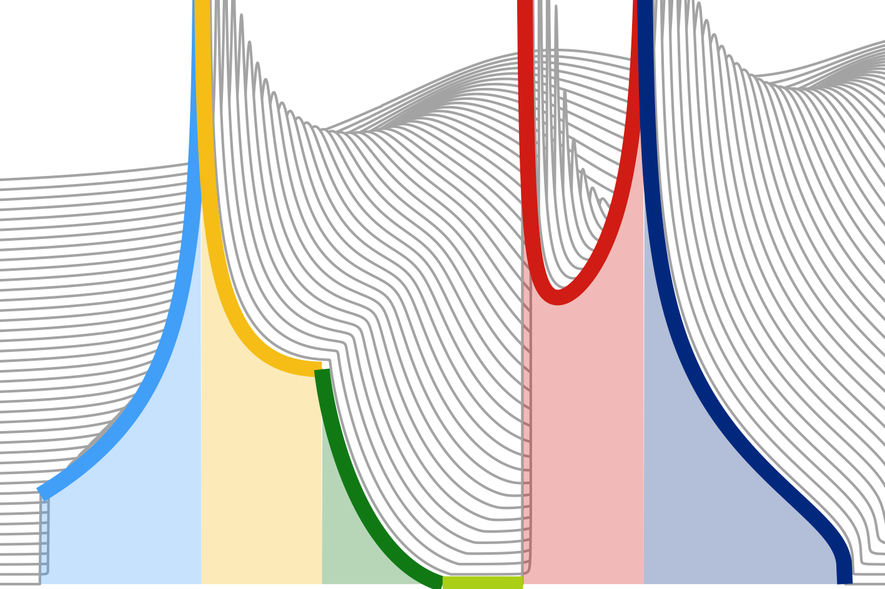

# Piecewise 

<!---->

The [Julia](https://julialang.org/) module **Piecewise** provides tools for defining a piecewise function made of arbitrary user-defined elementary functions with parameters. Properly configured elementary functions enable fast **integral transforms** of the piecewise function. The module defines seven elementary functions and a method for fitting a piecewise function to a real function of a real variable.

The module **PiecewiseHilbert** adds methods to the elementary functions defined in **Piecewise**, enabling a fast Hilbert transform of the piecewise functions that use these elementary functions.

The module **PiecewiseLorentz** adds methods to some of the elementary functions defined in **Piecewise**, enabling what we call a Lorentz transform of the piecewise functions.
